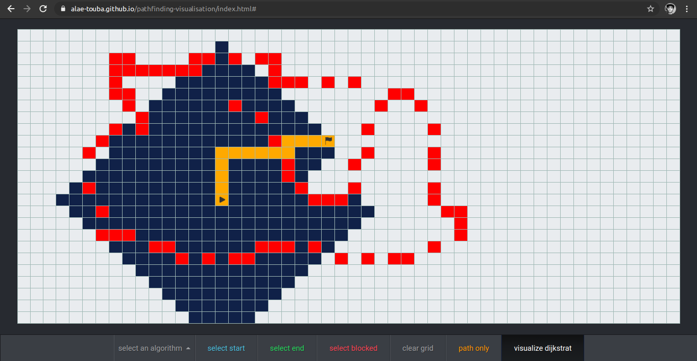
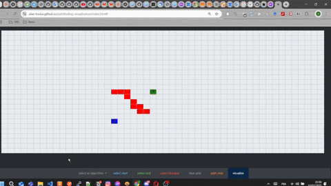

# Table of content

- [Table of content](#table-of-content)
- [About](#about)
- [App Url](#app-url)
- [Implemented Algorithms](#implemented-algorithms)
- [How To Use It](#how-to-use-it)
- [use it locally](#use-it-locally)
  - [Prerequisites](#prerequisites)
  - [install \& run](#install--run)


<a name="about"></a>

# About

Pathfinding algorithms are methods that explore routes between nodes in a graph, starting at one node and traversing through relationships(adjacent nodes) until the destination has been reached. These algorithms are used to identify optimal routes(shortest paths) through a graph for uses such as web mapping websites (such as google maps), IP routing, and gaming simulation.

I built this app as a fun side project using typescript/html/css in order to 'visualize searching a path from a source to a destination'.

Here is a demo of what the app looks like after exploring some nodes and finding a path from a source to a destination:


<video src='./static/pathfinding-visualisation.mp4' width='600'/>




<a name="app-url"></a>

# App Url

Here is the url for the app: [https://alae-touba.github.io/pathfinding-visualisation/index.html](https://alae-touba.github.io/pathfinding-visualisation/index.html)

<a name="implemented-algorithms"></a>

# Implemented Algorithms

For this app i implemented 4 well known graph algorithms:

-   _**Depth first search:**_\
    DFS is an algorithm for traversing or searching tree or graph data structures. The algorithm starts at a root node and explores as far as possible along each branch before backtracking. So the basic idea is to start from a node and mark the node as visited and move to the adjacent unmarked node and continue this loop until there is no unmarked adjacent node. Then backtrack and check for other unmarked nodes and traverse them. Finally print the nodes in the path.
    It finds JUST a path, not necessarily the shortest path.

*   _**Breath First search:**_\
    BFS visits the nodes in increasing order of their distance from the starting node. Thus, we can calculate the distance from the starting node to all other nodes using BFS.
    BFS search goes through the nodes one level after another. First the search explores the nodes whose distance from the starting node is 1, then the nodes whose distance is 2, and so on. This process continues until all nodes have been visited.
    It finds the shortest path.

*   _**Bellman ford:**_\
    The Bellman–Ford algorithm finds shortest paths from a starting node to all nodes of the graph. The algorithm keeps track of distances from the starting node to all nodes of the graph. Initially, the distance to the starting node is 0 and the distance to all other nodes in infinite. The algorithm reduces the distances by finding edges that shorten the paths until it is not possible to reduce any distance.
    It finds the shortest path.

-   _**Dijkstra’s algorithm:**_\
    Dijkstra’s algorithm finds shortest paths from the starting node to all nodes of the graph, like the Bellman–Ford algorithm. Like the Bellman–Ford algorithm, Dijkstra’s algorithm maintains distances to the nodes and reduces them during the search.
    It finds the shortest path.

<a name="how-to-use-it"></a>

# How To Use It

-   _**selecting a starting node:**_\
    click on the "select start" button in the bottom navbar and then click on the grid. (you will see the start node, at the clicked position)

-   _**selecting an ending node:**_\
    click on the "select end" button in the bottom navbar and then click on the grid. (you will see the end node, at the clicked position)

-   _**selecting blocked nodes:**_\
    click on the "select blocked" button in the bottom navbar, then click once in the grid and hover over a bunch of grid cells and then click on the grid again. there you are, your blocked cells are marked as red.

-   _**selecting an algorithm to visualize:**_\
    click on the "select an algorithm" button, a little window will pop-up, select the wanted algorithm.

-   _**visualize the path:**_\
    click on the "visualize" button in the botton navbar (really?).
    If there is a path, it will be shown with an orange color.

-   _**I will let you explore the other two options yourselves.**_
-   


# use it locally

## Prerequisites

- Node.js (v18.x or later)
- npm (v10.x or later)
- VS Code with Live Server extension (recommended)

## install & run
1. clone the repo

2. Install dependencies
```bash
npm install
```

3. Build the project
```bash
npm run build
```

4. open _index.html_ in the browser (i use __Live Server__ VSCode extension to launch index.html)


